<div align="center">

# 🔬 Drug Detective

### A Self-Improving Research Agent for Drug Repurposing

*The agent doesn't just rank candidates — it investigates them, learns which lines of enquiry
failed, changes its own strategy, and writes what it found into a real system.*

</div>

---

## The problem

Most disease→drug tools answer once and stop. Ask again and you get the same answer, whether or
not the last one was any good.

Drug Detective runs an investigation **loop**. It picks candidates, gathers live evidence, screens
it, records what worked and what didn't, then **changes exactly one thing about how it
investigates** and goes again — so round 2 is measurably a different experiment from round 1.

## The loop

```
Completed search (64 ranked candidates)
        │
        ▼
  ROUND 1  ── pick top-ranked candidates
        │    ├─ You.com      → live web evidence, newer than any index
        │    └─ Daytona      → sandboxed screening (corroboration / quality / CONTRADICTION)
        ▼
  EXPERIENCE  ── append what worked + what failed to persistent memory
        │
        ▼
  STRATEGY   ── pure deterministic function reads memory, moves ONE lever:
        │       candidate_selection │ evidence_priority │ query_formulation
        ▼
  ROUND 2  ── genuinely different experiment
        │
        ▼
  ONE → writes the outcome into the user's real Notion workspace
```

Two things make this a loop rather than a two-step script:

1. Each round's strategy is derived by **reading the previous round's experiences back out of
   storage** — not by passing state in process.
2. **Round 1 is not hardcoded to the default strategy.** If this disease has been investigated
   before, the agent recalls that run and starts from an already-adapted strategy. Investigate the
   same disease twice and the second attempt genuinely begins smarter.

## The line we don't cross

> **No LLM touches the score, and no LLM chooses the adaptation.**

- **Ranking** is Phase 1's deterministic weighted sum (gene 35 / drug-target 30 / literature 20 /
  trials 10, safety −5). Unchanged by this project.
- **The strategy change** is a pure function in [`agent/strategy.py`](phase2/backend/agent/strategy.py) —
  same history in, same strategy out, every time. Unit-tested for exactly that.
- **CrewAI narrates** the decision for a human reader. It does not make it.
- A contradiction found in fresh evidence downgrades the **investigation verdict only** — never the
  scientific score.

That boundary is the point. It's what makes the adaptation reproducible and auditable instead of
vibes from a language model.

## Sponsor integrations

Each has exactly one defensible job. All four degrade to a skipped status rather than failing a round.

| | Role | Where |
|---|---|---|
| **You.com** | Live web evidence per hypothesis, every item stamped with source URL, query used, retrieval time. Makes the `query_formulation` lever real — it literally changes the search. | [`agent/youcom.py`](phase2/backend/agent/youcom.py) |
| **CrewAI** | 3 agents — Research, Evidence, Critic — narrate the round. The Critic explains an already-made deterministic decision. | [`agent/crew.py`](phase2/backend/agent/crew.py) |
| **Daytona** | Runs the screening script off-box. It executes untrusted scraped text, so it does not belong in the API process. Arithmetic stays deterministic. | [`agent/sandbox.py`](phase2/backend/agent/sandbox.py) |
| **One** | The external side effect: publishes the round's learning + strategy change to a real Notion workspace via the passthrough API. | [`agent/one_client.py`](phase2/backend/agent/one_client.py) |

**Clean Data** is the provenance layer, not a bolt-on: every evidence item carries `source`,
`url`, `query_used` and `retrieved_at`, and `sources_used` on each round reports honestly which
integrations actually ran.

## A real run

Live, ALS, nothing mocked. **Two investigations of the same disease**, back to back:

```
INVESTIGATION 1 — no prior memory
  R1  TOFERSEN · DEXTROMETHORPHAN · CARBETAPENTANE      mean 0.617
      └ CARBETAPENTANE weak: no literature, no trials
  LEVER  candidate_selection:  top_ranked → skip_unproductive
  R2  TOFERSEN · DEXTROMETHORPHAN · DACOMITINIB         mean 0.617   delta 0.000

INVESTIGATION 2 — recalls investigation 1
  RECALLED  already ruled out: CARBETAPENTANE, DACOMITINIB
  R1  TOFERSEN · DEXTROMETHORPHAN · PENTAZOCINE         mean 0.625   ← starts higher
  R2  TOFERSEN · DEXTROMETHORPHAN · AFATINIB            mean 0.651   ← ends higher
```

**Investigation 1 ends flat, and we show it that way.** The agent correctly abandoned a dead end;
the next-ranked replacement happened to be weak too, so the mean didn't move. The UI renders
`No confidence change` in neutral grey. A demo that always improves isn't demonstrating learning,
it's demonstrating a hardcoded string.

The improvement shows up where it should — **across** investigations, as memory accumulates and
the agent stops re-investigating known dead ends.

On glioblastoma the same engine picks a *different* lever. All three candidates held up, so
instead of swapping candidates it reframed the question:

```
LEVER  query_formulation:  drug_disease → mechanism_pathway
  R1  AFATINIB 0.927 · ERLOTINIB 0.788 · DEPATUXIZUMAB 0.748   mean 0.821
  R2  AFATINIB 1.000 · ERLOTINIB 0.910 · DEPATUXIZUMAB 0.810   mean 0.907   delta +0.086
```

Same code, different failure mode, different adaptation.


## Architecture

```mermaid
flowchart LR
    U(["disease<br/>query"]) --> P

    subgraph EXISTING["Existing pipeline — UNTOUCHED"]
        direction LR
        P["Open Targets · PubMed<br/>openFDA · trials"] --> RANK["<b>Deterministic ranking</b><br/>35·30·20·10 −5<br/><b>no LLM</b>"]
    end

    RANK -->|"ranked<br/>candidates"| R1

    subgraph LOOP["Self-improving investigation loop — POST /api/investigate/:id"]
        direction LR
        R1["<b>ROUND N</b><br/>select<br/>candidates"] --> YOU["<b>You.com</b><br/>live evidence<br/>+ provenance"]
        YOU --> DAY["<b>Daytona</b><br/>sandboxed screen<br/>CONTRADICTION"]
        DAY --> EVAL["investigation<br/>confidence"]
        EVAL --> MEM[("<b>Experience</b><br/>worked /<br/>failed")]
        MEM --> STRAT["<b>strategy.py</b><br/>ONE lever<br/><b>no LLM</b>"]
        STRAT -.->|"<b>adapt & re-run</b>"| R1
    end

    STRAT --> ONE["<b>One</b>"] --> NOTION[("📝 <b>Real Notion page</b><br/>external side effect")]
    STRAT --> CREW["<b>CrewAI</b> · 3 agents<br/><i>narrates, does not decide</i>"]

    classDef untouched fill:#1e293b,stroke:#64748b,color:#e2e8f0
    classDef loop fill:#052e16,stroke:#22c55e,color:#dcfce7,stroke-width:2px
    classDef sponsor fill:#1e1b4b,stroke:#818cf8,color:#e0e7ff
    classDef sink fill:#422006,stroke:#f59e0b,color:#fef3c7
    class P,RANK untouched
    class R1,EVAL,STRAT loop
    class YOU,DAY,CREW,ONE sponsor
    class MEM,NOTION sink
```



**Read the diagram for two things.** First, the grey box is untouched — the scientific score is
still Phase 1's deterministic arithmetic. Second, follow the memory node: round 2's strategy is
derived by **reading experience back out of storage**, not by passing state in process. That is
what makes it a closed loop rather than a two-step script.

### Code layout

Additive. The existing pipeline was not rewritten.

```
phase1/src/            Phase 1 pipeline + deterministic ranking   ← UNTOUCHED
phase2/backend/
  main.py              FastAPI. + POST /api/investigate/{id}      ← 1 endpoint added
  agent/
    experience.py      persistent JSONL memory (Supabase-swappable)
    strategy.py        experiences → next strategy (pure, deterministic)
    rounds.py          round orchestration
    youcom.py  sandbox.py  one_client.py  crew.py
  tests/               15 local tests, no network, 0.06s
phase2/frontend/
  components/AgentInvestigation.tsx    the loop, made visible
```

`/api/investigate/{search_id}` reuses an **already-completed** search, so the multi-minute disease
pipeline never re-runs.

## Run it

```bash
# Backend — Python 3.11 or 3.12 (crewai's tiktoken has no 3.13/3.14 wheel yet)
cd phase2/backend
python3.12 -m venv .venv
./.venv/bin/pip install -r requirements.txt          # or requirements.lock.txt for exact versions
cp .env.example .env        # add your keys
ENABLE_CREWAI=1 ./.venv/bin/python -m uvicorn main:app --port 8000

# Frontend
cd phase2/frontend && npm install && npm run dev
```

Then search a disease, and hit **Run Agent Investigation** at the top of the results.

Every integration is optional. With no keys at all, the loop still runs on pipeline evidence —
you just lose live retrieval, sandboxed screening, narration and the Notion write.

## Tests

```bash
cd phase2/backend && ./.venv/bin/python -m pytest tests/ -q      # 25 passed in 0.06s
```

Covers persistence and run isolation, the default round-1 strategy, each adaptation lever, **the
one-lever-per-round invariant**, determinism, N-round orchestration, **cross-investigation recall**,
and the guarantee that **CrewAI cannot overwrite the deterministic decision**. No network.

## What this is not

Stated plainly, because a prototype that oversells itself is worth less than one that doesn't.

- **The adaptation space is small.** Three levers, one moved per round, chosen by a fixed priority
  ladder. That is deliberate — it is what makes the change attributable — but it is a rule-based
  policy, not a learned one. No model is trained, fine-tuned or rewarded here.
- **`query_formulation` alternates.** With only two framings, a run that keeps reaching lever 3
  toggles between them rather than converging. Fine for two rounds; it would need more framings, or
  a convergence check, to run long.
- **`investigation_confidence` is a heuristic, not a validated metric.** The weights are reasonable
  and deterministic, but they are not calibrated against any benchmark of real repurposing outcomes.
  Treat it as a triage signal for where to look next, never as a probability of success.
- **Memory is a local JSONL file**, keyed by disease. It is durable and it survives restarts, but
  it is single-node. The interface is narrow (`record` / `load` / `clear`) precisely so a Supabase
  table can replace it without touching a caller.
- **Live retrieval is as good as the web.** You.com returns pages, and the sandbox screens them
  with keyword heuristics. It catches an obvious "trial terminated"; it will not catch a subtly
  negative result phrased carefully.
- **Not deployed.** It runs locally. The Dockerfile and `fly.toml` are there and the Docker image
  targets Python 3.11, but the backend has not been shipped.

**It is a research-support prototype.** Outputs are hypotheses for a human to investigate.

---

> ⚕️ **Research-support prototype.** Outputs are drug repurposing **hypotheses for investigation**,
> never treatment recommendations. Not medical advice.
